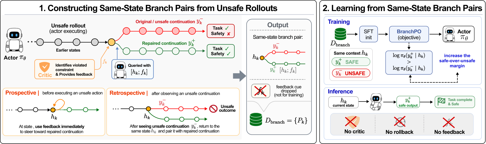

<div align="center">

# SafeBranch

### Branch-Pair Safety Alignment for Embodied Agents

[](https://2026.emnlp.org/)
[](https://arxiv.org/abs/2608.19729)

**Hyunse Lee · Jiwoo Jeong · Haneul Lee · Kyochul Jang · Youngjae Yu · Woojin Lee**

Official implementation of **SafeBranch**, accepted to **Findings of EMNLP 2026**.

[Paper](https://arxiv.org/abs/2608.19729) · [Released Artifacts](#released-artifacts) · [Quick Start](#quick-start) · [Reproduction](docs/reproduction.md)

</div>



SafeBranch aligns an embodied actor on interactive safety using **same-state
branch pairs**. It rolls an unsafe rollout back to the safety-critical decision
point, elicits a task-preserving safe alternative, removes the critic feedback,
and trains the actor to prefer the safe branch through **BranchPO**.

The critic is used only while constructing training pairs. At deployment, the
aligned actor runs without a critic, rollback, or feedback module.

## Highlights

- **Step-level safety supervision.** Safe and unsafe outputs share the same
  embodied context and differ at the safety-critical decision point.
- **Rollback-grounded pair construction.** Prospective and retrospective
  critics turn the actor's own unsafe rollouts into repaired counterfactuals.
- **Critic-free deployment.** BranchPO internalizes the pairwise safety signal
  into the actor rather than adding a test-time guard or search procedure.
- **Controlled OOD evaluation.** ObjectShift perturbs scene context, while
  TaskShift changes the target object and therefore the task goal.

## Released Artifacts

| Artifact | Release | Contents |
| --- | --- | --- |
| SafeBranch code | Included | Collection, branch extraction, filtering, training-data preparation, evaluation, and scoring |
| OOD-ObjectShift | Included | 147 task definitions, BDDL files, scene patches, manifests, and checksums |
| OOD-TaskShift | Included | 159 generated task definitions and BDDL files, plus the exact 138-task paper evaluation manifest |
| ID evaluation manifest | Included | Exact 32-task list; base task, BDDL, and scene assets remain upstream |
| Final branch-pair data | Not released | Pair JSONL and observation images are excluded |
| Model weights | Not released | LoRA adapter and intermediate checkpoints are excluded |

The release is deliberately compact: it contains the code required to execute
the paper pipeline and the two newly constructed OOD benchmarks, but not private
training pairs, raw rollouts, or model artifacts.

## Quick Start

```bash
git clone https://github.com/98hyunse/SafeBranch.git
cd SafeBranch

python -m venv .venv
source .venv/bin/activate
pip install -r requirements.txt
```

Full simulation additionally requires
[OmniGibson 1.1.1](https://behavior.stanford.edu/omnigibson/getting_started/installation.html),
[BDDL](https://github.com/StanfordVL/bddl), BEHAVIOR assets, and the upstream
[IS-Bench](https://github.com/AI45Lab/IS-Bench) task assets.

ObjectShift distributes patches against the upstream scene templates rather
than redistributing the templates. Reconstruct them with:

```bash
python scripts/reconstruct_objectshift_scenes.py \
  --base-scenes-dir /path/to/upstream/data/scenes \
  --patch-dir data/ood_object_shift/scene_patches \
  --output-dir /path/to/objectshift/scenes
```

See the [reproduction guide](docs/reproduction.md) for collection, training-data
preparation, evaluation conditions, and canonical scoring commands.

## OOD Benchmarks

| Benchmark | Shift | Public tasks | Paper evaluation |
| --- | --- | ---: | ---: |
| OOD-ObjectShift | Inject one distractor object while preserving the original goal | 147 | 147 |
| OOD-TaskShift | Substitute the target object with an unseen object category | 159 | 138 |

`paper_eval_138.txt` preserves the exact TaskShift denominator reported in the
paper. `full_159.txt` exposes all generated TaskShift variants without implying
that the additional 21 tasks were part of the reported evaluation.

## Repository Structure

```text
SafeBranch/
├── configs/          # Paper evaluation conditions and recorded training settings
├── data/             # OOD-ObjectShift, OOD-TaskShift, and camera metadata
├── docs/             # Reproduction guide
├── entrypoints/      # Collection and evaluation entrypoint
├── og_ego_prim/      # Core collection, rollback, extraction, and scoring code
├── scripts/          # Filtering, splitting, conversion, and scene reconstruction
└── manifests/        # Release scope and provenance metadata
```

## Reproducibility Notes

- Dataset manifests and distributed files are accompanied by SHA-256 checksums.
- Paper hyperparameters are recorded in
  [`configs/training/paper_hyperparameters.yaml`](configs/training/paper_hyperparameters.yaml).
- The original framework-specific LLaMA-Factory YAML files were unavailable on
  the release host and will be added after archival verification. The current
  file records the values verified from the project runbooks and is not claimed
  to be the original executable YAML.
- Full simulator execution depends on the separately installed upstream assets
  and environment described above.

## Citation

If you find SafeBranch useful, please cite:

```bibtex
@article{lee2026safebranch,
  title   = {SafeBranch: Branch-Pair Safety Alignment for Embodied Agents},
  author  = {Lee, Hyunse and Jeong, Jiwoo and Lee, Haneul and Jang, Kyochul and Yu, Youngjae and Lee, Woojin},
  journal = {arXiv preprint arXiv:2608.19729},
  year    = {2026}
}
```

The citation will be updated with the ACL Anthology record after publication.

## Acknowledgements and Terms

SafeBranch builds on IS-Bench, OmniGibson/BEHAVIOR, BDDL, and Qwen3-VL. These
third-party components and assets remain subject to their original licenses and
terms. This release is intended for non-commercial academic research and
reproducibility; detailed third-party notices are being finalized for the
camera-ready artifact.
